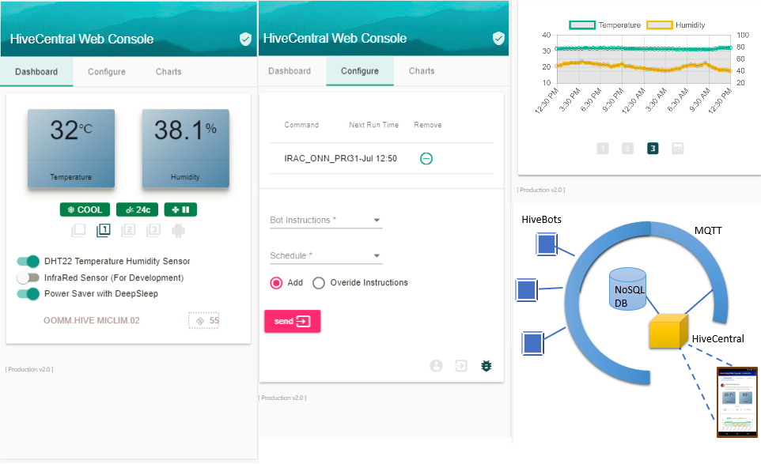

# HiveCentral
Web Application & Controller for the **HiveBot** IOT Devices. The controllers has services to register and maintain life cycle and the status of the IOT Bots. All IOT devices refered as **HiveBot**  have to connect via common MQTT bridge and follow the custom protocol and JSON format for data exchange.

[HiveCentral Demo ](http://h2central-hive.193b.starter-ca-central-1.openshiftapps.com/ng/) hosted on OpenShift
Current Build Image : openshift/redhat-openjdk18-openshift:1.2

## Features
  - REST API for Registering new HiveBots , view DataMap and Instructions.
  - REST API for sending Instructions to HiveBots
  - Integration  MICLIMATE  HiveBot for Temperature , Humidity , IR Signals from Aircon
  - Integration with NEA to source outdoor weather.
  - Charting for sensor data using ChartJS
  - Support for AirCon registered profiles used by HiveBots to send IR signals.
  - Scheduling instructions for HiveBots with features to pull all instruction backlogs after DeepSleep or Cold Restarts.
  - Progress Web App ( Under Development)



## Technology Stack
 - Framework & Libraries
	 - Spring Boot & Integration
	 - Mongo DB 3.x (Persistence NoSQL)
	 - Angular 7.0.x
	 - MQTT Broker
	 - Quartz Scheduler (2.2.1)
 - IDE & tools
	 - Angular CLI (7.0.x)
	 - Nodejs & npm
	 - Visual Studio Code (Recommended)
	 - IntelliJ IDEA (Recommended)
	 - Maven (Build)
 - Embedded tools and Support Libraries
     - [Rabbit MQ](https://www.rabbitmq.com/) MQ/MQTT Message Broker.
     - [Swagger UI](https://swagger.io/swagger-ui/)

Building Maven Project
----------
    mvn clean compile verify spring-boot:run
    Environment Variables = "SPRING_PROFILES_ACTIVE=ModuleNEACollect, ModuleMQTT;logging.level.org=DEBUG"

    //Quick Bootup
    -pl hivecontroller-svc spring-boot:run
    Environment Variables = "SPRING_PROFILES_ACTIVE=ModuleNEACollect, ModuleMQTT"


Deploying Maven Project
----------
    mvn compile verify deploy
    // to skip testing
    -Dmaven.test.skip=true


Angular CLI for Running Development container
----------
    cd hivewebapp-ui
    ng serve --host 192.168.1.xxx

## Addtional Setup for Local Maven for Distro + Deployment
Changes to be made for ***.m2/settings.xml***


```
<server>
  <id>DISTROSERVER</id>
  <username></username>   <password></password>   <filePermissions>664</filePermissions>
  <directoryPermissions>775</directoryPermissions>   <configuration></configuration>
</server>
<server>
  <id>DEPLOYSERVER</id>
  ....
</server>
```

```
<profile>
    <id>windows10.local</id>
    <activation> <!-- activate if Windows Machine -->
    <os>
        <family>Windows</family>
    </os>
    </activation>
    <properties>
        <profile.distroserver.url>scp://192.168.1.xxx//PathToRepository</profile.distroserver.url>
        <profile.deployserver.url>scp://192.168.1.xxx//PathToDeploymentArea</profile.deployserver.url>
        <sonar.host.url>https://sonarcloud.io</sonar.host.url>
        <sonar.organization>xxx-xxxx-xxxxx</sonar.organization>
        <sonar.login>x0x0x0x0x0x0x0x</sonar.login>
    </properties>
</profile>
```

Maven Check Active Profile
----------
    mvn help:active-profiles
    
Spring Profiles for Application. 
----------
Set OS Environment ***SPRING_PROFILES_ACTIVE*** to change default behaviour. 
Multiple values(comma, separated) can be used.
    
    'ModuleNEACollect' | Enable NEA Data Collection Module
    'ModuleMQTT' | Enable MQTT Connectivity 

Registering HiveBots  
----------
Use the ***/swagger-ui.html*** for Registration & Setting up the HiveBots.
Below sample is for setting up a MicroClimate HiveBot 
    
Register a new HiveBot (Controller : ***/api/hivecentral/secure/register.new***)
Secure Access Required, Use Login Feature in NgApp to login as 'guest'
```
	Payload =  {
		"hiveBotId": "DEMO.HIVE MICLIM.01",   
		"hiveBotVersion": "1.0" 
	}
	Returns = "accessKey": "7c85a75e121be..........."
```

Initialize & Setup with Default Values for Demo (Controller : ***/api/hivecentral/secure/save.{options}***)
Secure Access Required, Use Login Feature in NgApp to login as 'guest'
```
	options = set_datamap
	Payload  = {
	"accessKey": "7c85a75e121be...........",
	"hiveBotId": "DEMO.HIVE MICLIM.01",
	"enabledFunctions" : ".+DHT22+DEEPSLEEP",
	"dataMap" : {
		"Temperature" : "30.80",
		"HumidityPercent" : "57.30",
		"DHT22_SensorStatus" : "OK",
		"DHT22_SensorStatusTime" : "1519568359293",
		"AcPower" : "ON",
		"AcTemp" : "24",
		"AcMode" : "3",
		"AcFan" : "4",
		"AcProfileId" : "3"
	}
```


Setting up for OpenShift Deployment   
----------
Using RedHat Java S2I Image and MongoDB.
...work in Progress. 